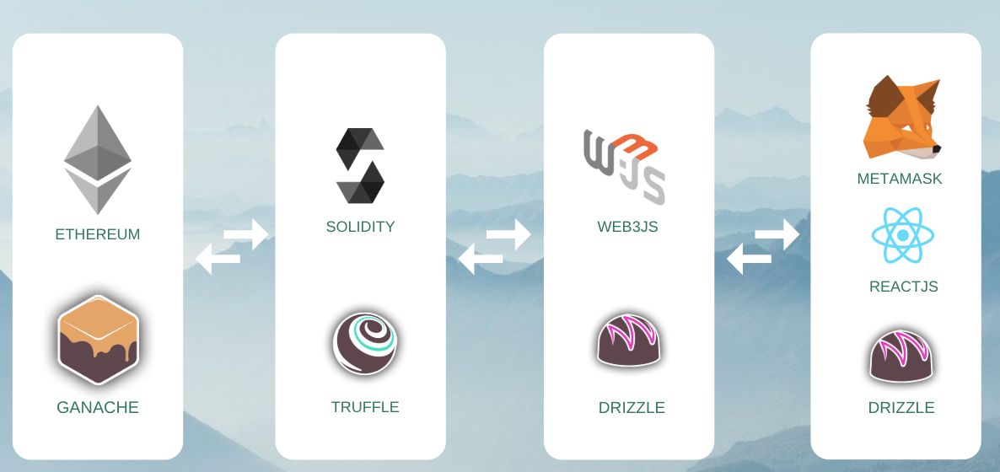

### IDEA

... WIP

### ARCHITECTURE

<div>

</div>

### SET UP

In the project directory, start by installing truffle

```
yarn global add truffle
```

Then, compile your solidity contracts and migrate them to the network:

```
truffle compile
truffle migrate
```

Then, change your working directory to the client and install yarn packages:

```
cd client
yarn install
```

Then, download [Ganache](https://truffleframework.com/ganache) (to run a test blockchain on your machine) and make sure you have [Metamask](https://metamask.io/) installed on your Chrome browser.

On Metamask, chose to connect to a local network by clicking on the top-right circle. Ensure that the localhost ports are set to the same in Ganache, Metamask and the _truffle-config.js_ file.

The interface should now be visible. You can create multiple accounts on Metamask to simulate usage by distinct nodes.

Notes for usage:

- Enter buyer, seller and carrier as **Ethereum addresses**.
- Once the contract is created, you can click on it to render it on the table on the right.
